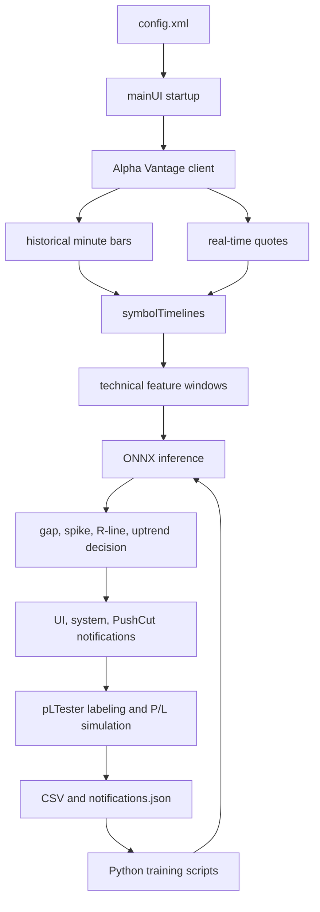

# One-Year Re-entry Guide

This is the fast reload. Read this first, then jump to the deeper docs.

## What HypeTrain Does

HypeTrain watches stocks, builds rolling OHLCV timelines, computes technical features, runs ONNX models, and turns
confirmed events into notifications. There are two main modes:

- Desktop monitoring mode: `org.crecker.mainUI`
- Backtesting, labeling, and dataset creation mode: `org.crecker.pLTester`

The app uses Alpha Vantage for data, JFreeChart for charts, Swing for UI, ONNX Runtime for inference, and
Python/TensorFlow scripts to train model files under `rallyMLModel/`.

## Mental Model



## First 15 Minutes

1. Compile the Java code:

   ```bash
   mvn -DskipTests compile
   ```

2. Check that `config.xml` exists in the repo root and has placeholders or real local secrets.

3. Check that the three ONNX files exist:

   ```bash
   ls rallyMLModel/*.onnx
   ```

4. Start the app from IntelliJ or with:

   ```bash
   mvn exec:java -Dexec.mainClass=org.crecker.mainUI
   ```

5. In the UI, verify Settings:

    - Alpha Vantage key.
    - Trading212 key if you want broker links/liquidity context.
    - PushCut endpoint if you want phone alerts.
    - Trade volume.
    - Market regime.
    - Candle chart toggle.
    - Real-time and second framework toggles.

## Key Concepts You Must Remember

`symbolTimelines`

The primary in-memory store for historical/minute data. Most analysis runs on this map. It lives in `mainDataHandler`.

`realTimeTimelines`

Short second-level store used only by the second framework. It keeps recent real-time ticks, detects second-based
spikes, aggregates them into a minute-like bar, then calls the normal advanced processing path.

`cache/`

Local per-symbol text files containing serialized `StockUnit` objects. Cache avoids huge repeated Alpha Vantage
downloads.

`rallyMLModel/`

Python scripts, datasets, generated CSVs, notification training JSON, and ONNX models.

`config.xml`

Local runtime config. It is ignored by git. It can contain secrets. The Java loader currently reads it by array index,
so element order matters.

## Main Entry Points

| Entry point                       | Purpose                                                    |
|-----------------------------------|------------------------------------------------------------|
| `org.crecker.mainUI`              | Main desktop app                                           |
| `org.crecker.pLTester`            | Backtesting, chart labeling, notification dataset creation |
| `org.crecker.dataTester`          | Utility for fetching/caching Alpha Vantage intraday files  |
| `rallyMLModel/spikeModel.py`      | Trains `spike_predictor.onnx`                              |
| `rallyMLModel/uptrendML.py`       | Trains `uptrendML.onnx`                                    |
| `rallyMLModel/entryPrediction.py` | Trains `entryPrediction.onnx` from `notifications.json`    |

## Most Important Flow

```mermaid
flowchart LR
    Hype[Activate hype mode] --> Universe[Choose market regime symbols]
    Universe --> Tradable[Filter tradable/liquid symbols]
    Tradable --> Load[Load cache or download full intraday data]
    Load --> Precompute[Precompute indicator and feature ranges]
    Precompute --> Poll[Poll latest data every minute]
    Poll --> Percent[Update percent changes]
    Percent --> Windows[Build rolling 30-bar windows]
    Windows --> Infer[Run spike and uptrend models]
    Infer --> Trigger[Apply liquidity, threshold, and technical filters]
    Trigger --> Alert[Add notification]
    Alert --> Poll
```



## What To Be Careful With

- Do not commit or paste `config.xml` values.
- Do not rename ONNX files unless you also update `RallyPredictor`.
- Do not reorder `config.xml` tags without changing `mainUI.setValues()`.
- Do not assume the cache files are standard CSV. They are `StockUnit.toString()` dumps.
- Real-time logic is asynchronous and stateful. If you change shared maps, check synchronization.
- Python training scripts write ONNX into the current working directory. Run them from `rallyMLModel/`.

