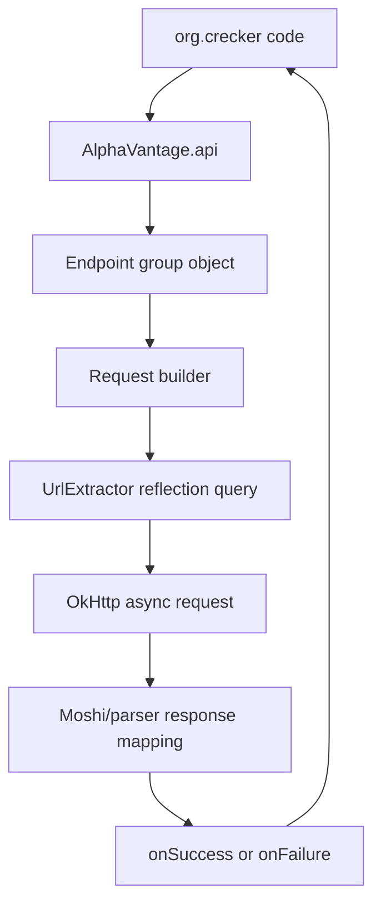
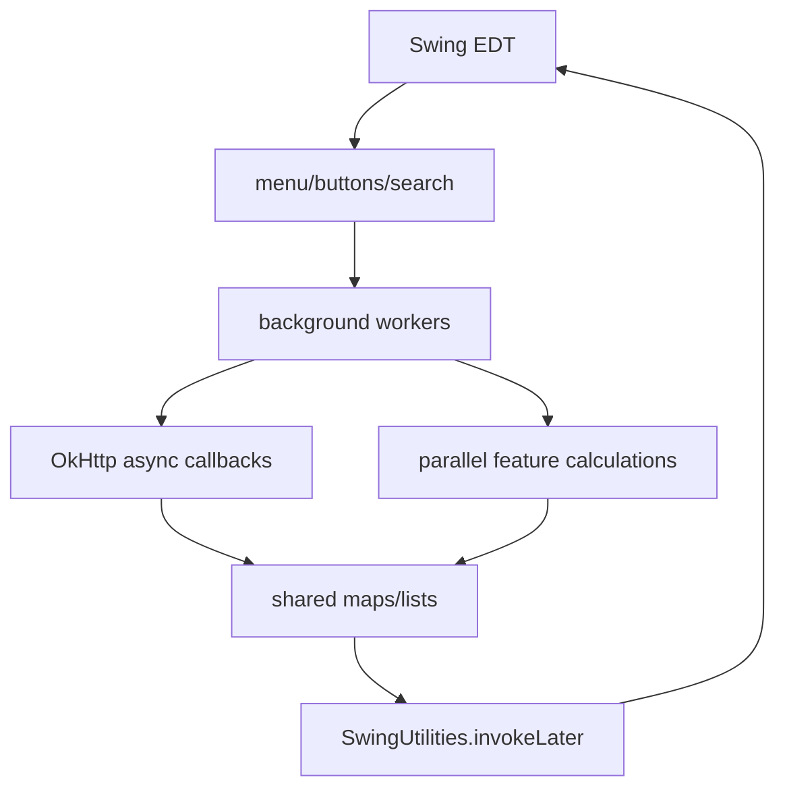

# Architecture

## Repository Map

| Path                                          | Purpose                                                     |
|-----------------------------------------------|-------------------------------------------------------------|
| `src/main/java/org/crecker/`                  | HypeTrain app code: UI, data processing, alerts, backtester |
| `src/main/java/com/crazzyghost/alphavantage/` | Vendored Alpha Vantage client library                       |
| `rallyMLModel/`                               | Python training scripts, ONNX models, datasets              |
| `cache/`                                      | Local generated stock-data cache, ignored by git            |
| `Examples/`, `trendAnalysis/`                 | Reference images and strategy examples                      |
| `train.png`                                   | App/taskbar icon                                            |
| `pom.xml`                                     | Maven build and dependencies                                |
| `config.xml`                                  | Local runtime config, ignored by git                        |

## Java Application Classes

| Class                    | Responsibility                                                                                                                        |
|--------------------------|---------------------------------------------------------------------------------------------------------------------------------------|
| `mainUI`                 | Main Swing app, menu actions, charts, watchlist, settings integration, notifications panel, stock/news display                        |
| `mainDataHandler`        | Central data pipeline: Alpha Vantage calls, symbol filtering, cache loading, rolling timelines, feature calculation, signal detection |
| `RallyPredictor`         | ONNX Runtime wrapper. Loads model sessions and manages rolling per-symbol inference buffers                                           |
| `Notification`           | Alert object and popup window with chart preview, markers, Trading212 link, and trade rules                                           |
| `NotificationLabelingUI` | Manual Good/Neutral/Bad labeling UI for generated notifications                                                                       |
| `pLTester`               | Backtest runner, interactive trade simulation, chart interval labeling, CSV/JSON export                                               |
| `dataTester`             | Fetches full intraday data and writes cache files                                                                                     |
| `settingsHandler`        | Swing settings dialog and config writer                                                                                               |
| `configHandler`          | XML load/save/default config creation                                                                                                 |
| `News`                   | News display window/object used by the UI                                                                                             |

## Vendored Alpha Vantage Client

The `com.crazzyghost.alphavantage` package is a local client library, not an external jar. The app calls it through:

```java
AlphaVantage.api().init(Config.builder().key(token).timeOut(10).build());
AlphaVantage.api().timeSeries().intraday()...
AlphaVantage.api().Realtime()...
AlphaVantage.api().fundamentalData().companyOverview()...
```

Important pieces:

| Class/package                                             | Role                                                   |
|-----------------------------------------------------------|--------------------------------------------------------|
| `AlphaVantage`                                            | Singleton facade that exposes endpoint groups          |
| `Config`                                                  | API key, base URL, OkHttp client, timeout              |
| `UrlExtractor`                                            | Reflection-based query string builder                  |
| `Fetcher`                                                 | Async success/failure callback interface               |
| `parser/*`                                                | Moshi parsing helpers and "None" number adapters       |
| `timeseries`, `realtime`, `news`, `fundamentaldata`, etc. | Endpoint-specific request builders and response models |

Alpha Vantage requests are mostly asynchronous and callback-driven. Some endpoints also expose sync fetches.



## Main Data Stores

| Store                        | Type                              | Owner                        | Meaning                                           |
|------------------------------|-----------------------------------|------------------------------|---------------------------------------------------|
| `symbolTimelines`            | `Map<String, List<StockUnit>>`    | `mainDataHandler`            | Primary historical/minute bars per symbol         |
| `realTimeTimelines`          | `Map<String, List<StockUnit>>`    | `mainDataHandler`            | Short second-based tick history                   |
| `notificationsForPLAnalysis` | `List<Notification>`              | `mainDataHandler`/`pLTester` | Generated notifications for backtest and labeling |
| `notificationHistory`        | `Map<String, List<Notification>>` | `mainUI`                     | Recent notification markers per symbol            |
| `SYMBOL_INDICATOR_RANGES`    | nested map                        | `mainDataHandler`            | Per-symbol technical indicator min/max ranges     |
| `SYMBOL_FEATURE_RANGES`      | nested map                        | `mainDataHandler`            | Per-symbol uptrend feature min/max ranges         |
| `nameToData`                 | `Map<String, TickerData>`         | `mainUI`                     | Trading212 ticker metadata and max open quantity  |

## Threading Model

The app is highly asynchronous:

- Swing UI updates must run on the Event Dispatch Thread via `SwingUtilities.invokeLater`.
- Alpha Vantage calls use OkHttp callbacks.
- Hype mode runs in a background thread.
- `mainUI` has separate scheduled executors for chart updates and notification updates.
- Hype mode uses `CountDownLatch` to wait for large batches of async API calls.
- The second framework owns a named `SecondFrameworkThread`.
- Several computations use `parallelStream`.

Shared structures are sometimes synchronized manually. Be conservative when changing code around `symbolTimelines`,
`realTimeTimelines`, and notification lists.



## Dependencies

The Maven project targets Java 16. Main dependencies:

- JFreeChart: charts and OHLC/candlestick rendering.
- JCalendar: date UI.
- OkHttp: HTTP client.
- Moshi and org.json: JSON parsing/building.
- ONNX Runtime: model inference from Java.
- Apache Commons Lang.
- FlatLaf: Swing look and feel.
- Jackson: JSON serialization for notification training data.

