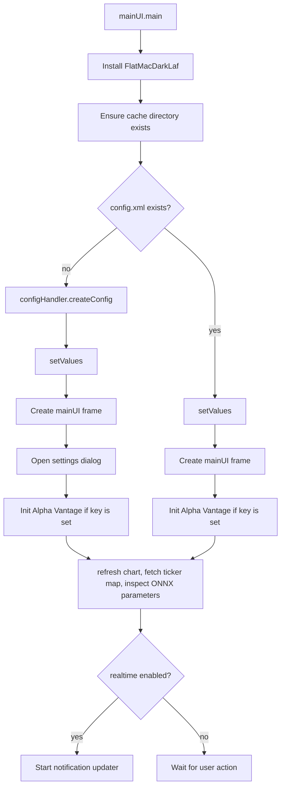
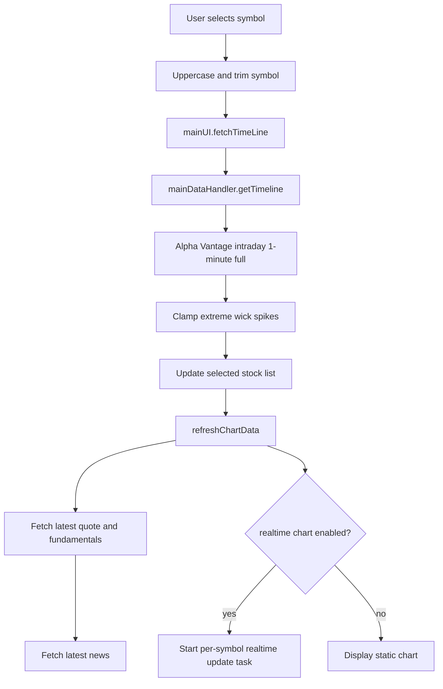
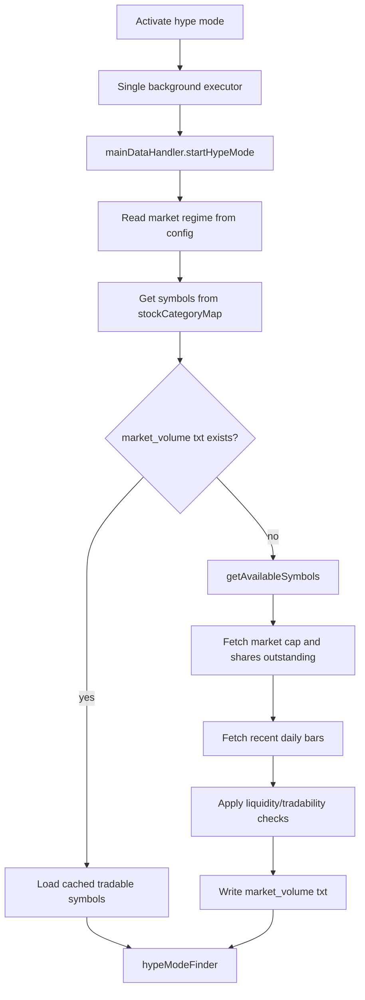
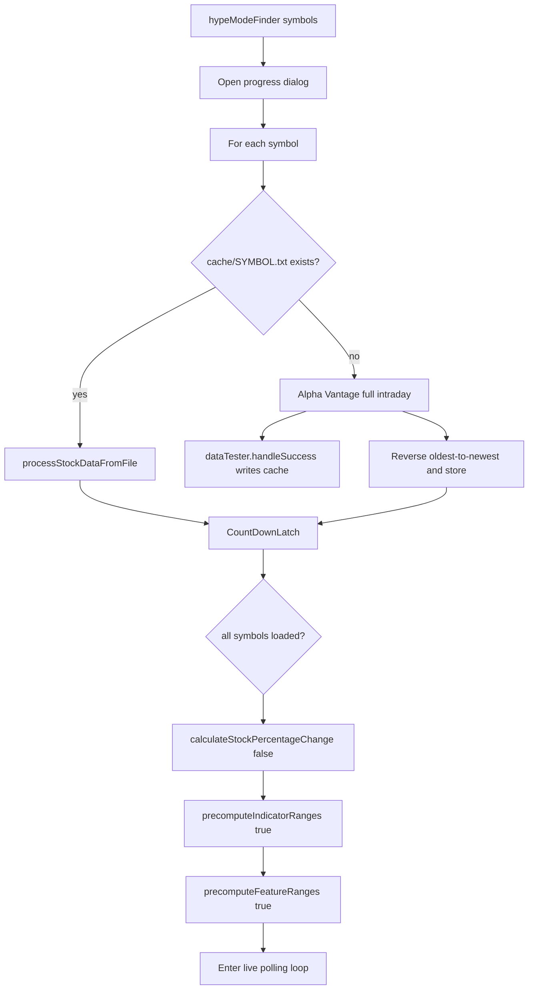
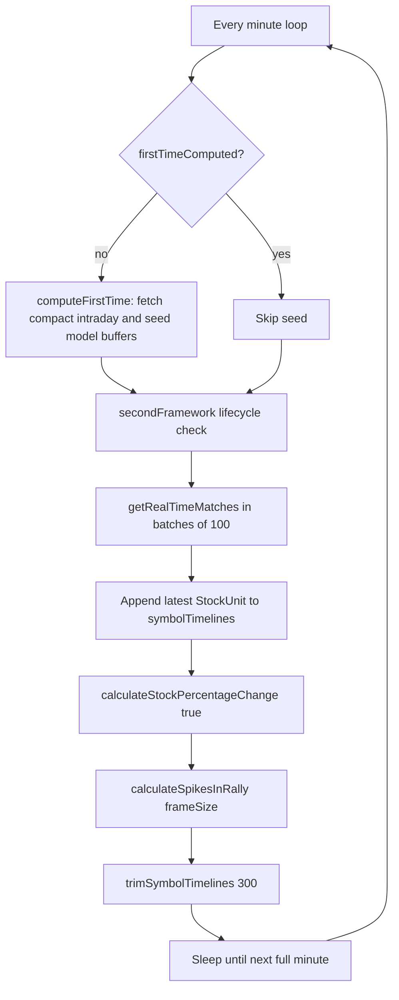
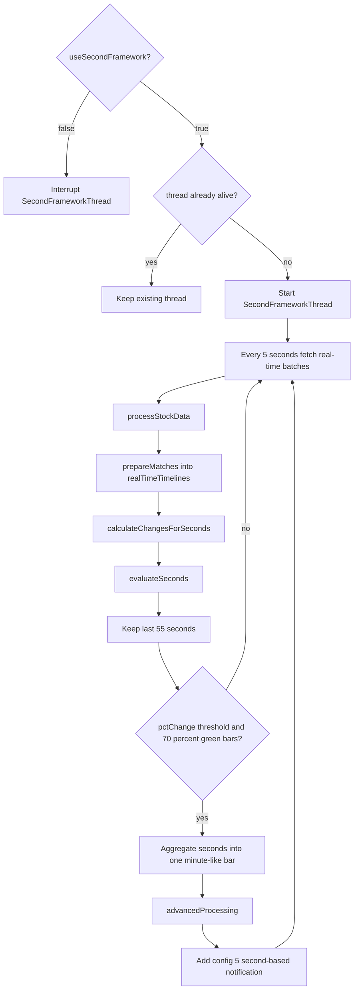
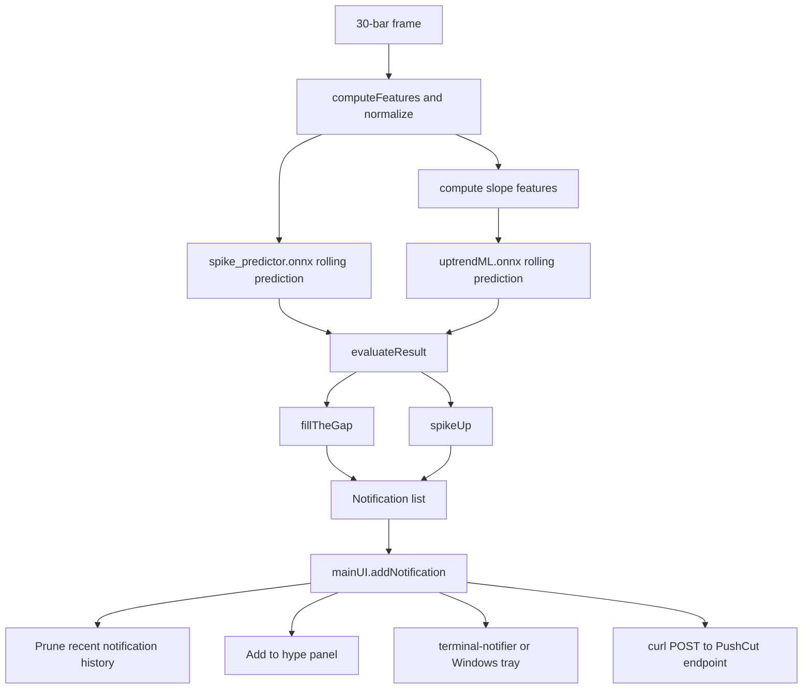

# Runtime Flows

## App Startup

Entry point: `org.crecker.mainUI.main`.

Startup side effects:

- Creates `cache/` if missing.
- Creates `config.xml` if missing.
- Loads watchlist symbols/colors into the left panel.
- Calls `RallyPredictor.setParameters()` to inspect ONNX input shapes.
- Starts notification updating if `realtime=true`.

## Selecting A Stock

Triggered by clicking a symbol in the watchlist or by opening a notification in the realtime chart.

The chart can be line or candlestick depending on `candle` in config. Time range buttons aggregate data into
minute/hour/day periods inside `mainUI`.

## Activating Hype Mode

Menu: `Hype mode -> Activate hype mode`.

`getAvailableSymbols` filters candidates by:

- Trade volume relative to market cap.
- Trade volume relative to average daily volume.
- Shares to trade relative to shares outstanding.

## Hype Mode Initial Load

Method: `mainDataHandler.hypeModeFinder`.

## Live Minute Polling Loop

There are two paths controlled by `useParallelFetch` in `mainDataHandler`.

The current default is `true`, so the app uses bulk real-time endpoint batching.

The older serial path calls `fetchSymbolData` for each symbol and waits with a latch.

## Second Framework

The second framework is enabled by `secondFrameWork=true` in `config.xml`. It is a faster, second-level scanner that
runs beside the minute loop.

## Signal And Notification Delivery

Notification config codes:

| Code | Meaning                |
|------|------------------------|
| `1`  | Gap fill               |
| `2`  | R-line near resistance |
| `3`  | Spike                  |
| `4`  | Uptrend                |
| `5`  | Second-based spike     |

## News And Company Overview

When a stock is selected:

- `mainDataHandler.receiveNews` fetches latest Alpha Vantage news for the ticker.
- News entries are shown in the news list and can be opened in a separate window.
- The company overview button calls `mainDataHandler.getCompanyOverview` and displays the description.

