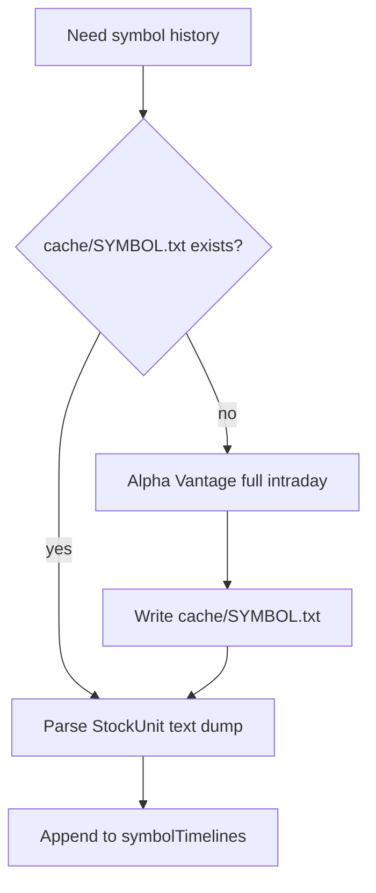

# Data, Config, And Files

## `config.xml`

`config.xml` is local runtime state and is ignored by git. It can contain live secrets.

Important: `mainUI.setValues()` reads the config as an array by position. Do not reorder tags unless you also change
`mainUI.setValues()` and `mainUI.getValues()`.

Expected order:

| Index | Tag               | Meaning                                                        |
|-------|-------------------|----------------------------------------------------------------|
| `0`   | `volume`          | Trade volume used for liquidity checks and alert sizing        |
| `1`   | `symbols`         | Watchlist string with `SYMBOL` and `java.awt.Color[...]` pairs |
| `2`   | `sort`            | Whether hype entries are sorted automatically                  |
| `3`   | `key`             | Alpha Vantage API key                                          |
| `4`   | `realtime`        | Enables chart/notification real-time updating                  |
| `5`   | `algo`            | Manual aggressiveness multiplier                               |
| `6`   | `candle`          | `true` for candlestick chart, `false` for line chart           |
| `7`   | `T212`            | Trading212 API key                                             |
| `8`   | `push`            | PushCut webhook endpoint                                       |
| `9`   | `market`          | Market regime key used by `stockCategoryMap`                   |
| `10`  | `secondFrameWork` | Enables the second-based scanner                               |

Safe template:

```xml
<?xml version="1.0" encoding="UTF-8" standalone="no"?>
<config>
    <volume>40000</volume>
    <symbols>[MSFT,java.awt.Color[r=221,g=160,b=221]],[NVDA,java.awt.Color[r=102,g=205,b=170]]</symbols>
    <sort>false</sort>
    <key>YOUR_ALPHA_VANTAGE_KEY</key>
    <realtime>false</realtime>
    <algo>1.0</algo>
    <candle>true</candle>
    <T212>YOUR_TRADING212_KEY</T212>
    <push>YOUR_PUSHCUT_ENDPOINT</push>
    <market>allSymbols</market>
    <secondFrameWork>false</secondFrameWork>
</config>
```

## Cache Files

Location: `cache/`

File naming:

```text
cache/AAPL.txt
cache/NVDA.txt
```

Format:

- Not CSV.
- Not JSON.
- A single serialized Java array-like string of `StockUnit{...}` entries.
- Written by `dataTester.handleSuccess`.
- Read by `pLTester.readStockUnitsFromFile` and `pLTester.processStockDataFromFile`.

Cache lifecycle:



## Hype-Mode Symbol Cache

Hype mode creates regime/volume text files in the repo root:

```text
allSymbols_40000.txt
favourites_20000.txt
aiStocks_90000.txt
```

Each line is a symbol that passed the liquidity/tradability filter for that regime and volume. Delete one of these files
if you want HypeTrain to re-run symbol filtering.

## Model Files

Java expects these exact ONNX paths:

| File                                | Java consumer                             | Meaning                                   |
|-------------------------------------|-------------------------------------------|-------------------------------------------|
| `rallyMLModel/spike_predictor.onnx` | `RallyPredictor.predict`                  | Rolling spike/rally model                 |
| `rallyMLModel/uptrendML.onnx`       | `RallyPredictor.predictUptrend`           | Rolling uptrend model from slope features |
| `rallyMLModel/entryPrediction.onnx` | `RallyPredictor.predictNotificationEntry` | Scores a notification entry window        |

`RallyPredictor.setParameters()` inspects the model input shapes at startup. If a model file is missing or has an
unexpected input/output name, Java inference will fail or return `0`.

## Training And Label Files

| File                                   | Producer                                                      | Consumer               |
|----------------------------------------|---------------------------------------------------------------|------------------------|
| `rallyMLModel/highFrequencyStocks.csv` | `pLTester` chart label export                                 | `spikeModel.py`        |
| `rallyMLModel/uptrendStocks*.csv`      | `pLTester` chart label export and helper scripts              | `uptrendML.py`         |
| `rallyMLModel/notifications.json`      | `NotificationLabelingUI` through `pLTester.dumpNotifications` | `entryPrediction.py`   |
| `rallyMLModel/clean_dataset_out/`      | `helpers/uptrend_generate_clean_dataset.py`                   | Manual review/training |
| `rallyMLModel/ae_plots/`               | `uptrendML.py --use-ae`                                       | Visual QA              |

`notifications.json` is newline-delimited JSON. Each line is one notification record, not one big JSON array.

## Data Quality Adjustments

The Java pipeline intentionally modifies raw data in a few places:

- `getTimeline` clamps extreme candle high/low spikes to avoid chart distortion.
- `calculateStockPercentageChange` clamps absurd percent changes above 14 percent by carrying the previous value.
- `fetchSymbolData` only appends bars at or before the last fully closed US/Eastern minute.
- `useExtended` uses extended-hours quote if regular close is zero/outside regular hours.
- Rally detection filters out weekends and regular-market out-of-hours bars before regression.

## Time Zones

Important time assumptions:

- Alpha Vantage stock timestamps are treated as US/Eastern in multiple paths.
- Notifications use `LocalDateTime` and are interpreted as America/New_York in pruning logic.
- System notifications compare against the JVM system zone.
- Real-time minute cutoff uses `ZoneId.of("US/Eastern")`.

Be careful when changing timestamp parsing or comparing notification age.

## Secrets

`.gitignore` ignores `config.xml`, `cache/`, and common build/IDE files. Keep secrets out of:

- Markdown docs.
- Commit messages.
- Console screenshots.
- Training output logs.
- Shared example configs.

