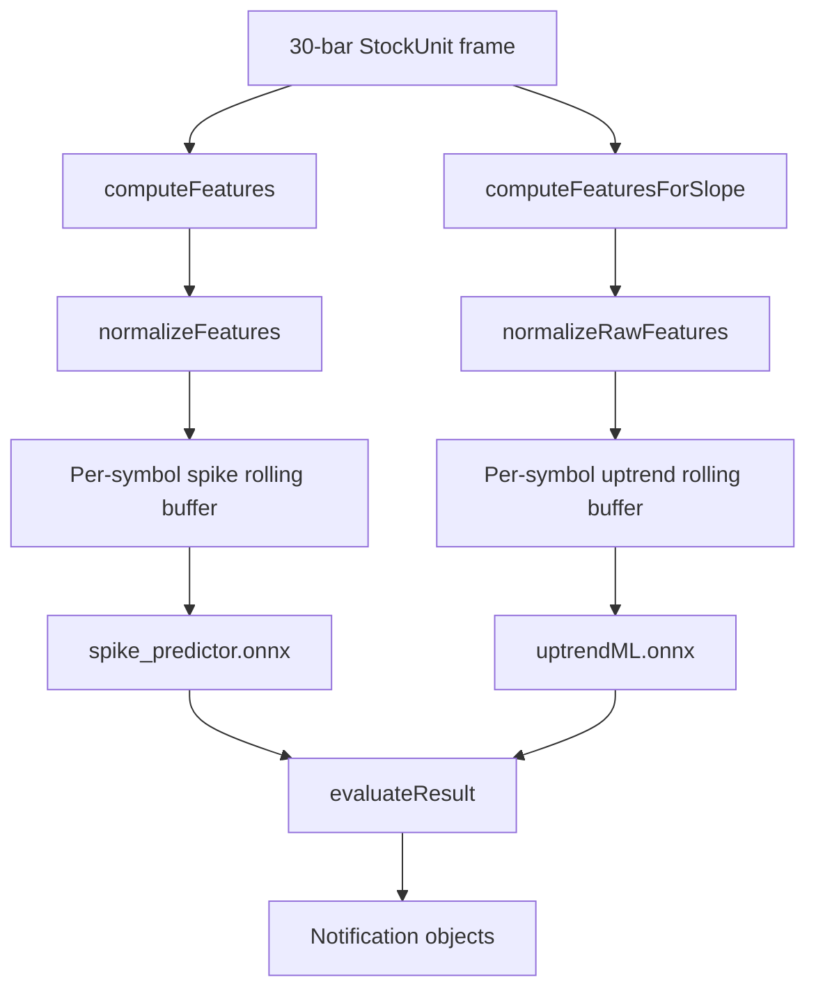
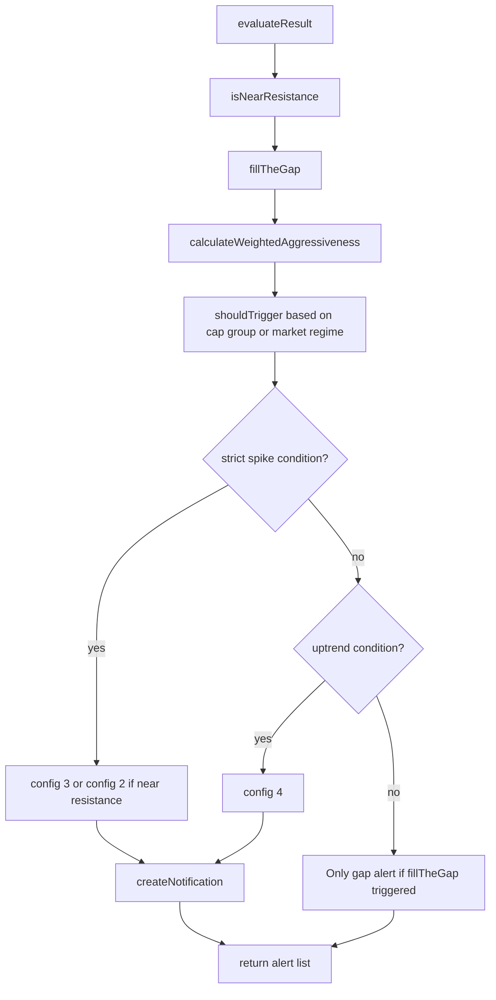
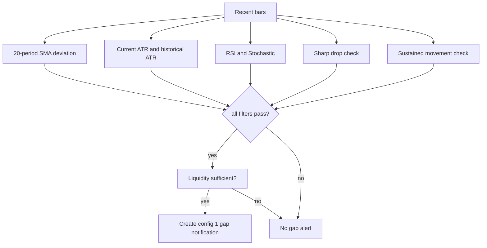
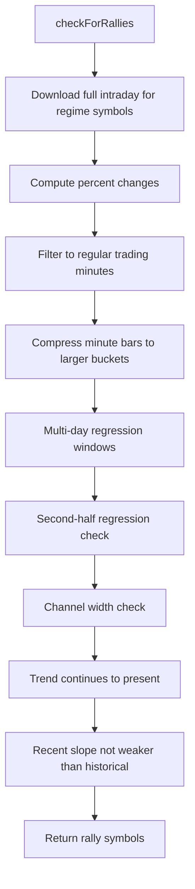

# Signals And Models

## Notification Types

HypeTrain creates five alert types:

| Code | Title pattern         | Meaning                                            |
|------|-----------------------|----------------------------------------------------|
| `1`  | `Gap SYMBOL`          | Gap-fill / oversold dip candidate                  |
| `2`  | `SYMBOL R-Line`       | Upward spike near resistance, proceed with caution |
| `3`  | `SYMBOL ↑`            | Strong spike                                       |
| `4`  | `SYMBOL Uptrend`      | Uptrend movement that is not a hardcore spike      |
| `5`  | `SYMBOL Second Spike` | Second-framework pre-predicted spike               |

All are represented by `Notification` objects and displayed in the hype panel. Each notification has a chart/preview
chart, marker color, timestamp, symbol, change value, content, and config code.

## Feature Sets

### Spike Feature Vector

Created by `mainDataHandler.computeFeatures`.

Order matters because the model and normalization depend on it:

| Index | Key                     | Meaning                        |
|-------|-------------------------|--------------------------------|
| `0`   | `SMA_CROSS`             | 9/21 SMA crossover state       |
| `1`   | `TRIX`                  | Triple exponential momentum    |
| `2`   | `ROC`                   | 20-period rate of change       |
| `3`   | `PLACEHOLDER`           | Constant placeholder           |
| `4`   | `CUMULATIVE_PERCENTAGE` | Binary cumulative spike signal |
| `5`   | `CUMULATIVE_THRESHOLD`  | Raw cumulative percentage move |
| `6`   | `KELTNER`               | Keltner breakout signal        |
| `7`   | `ELDER_RAY`             | Elder Ray index                |

Normalization:

- Binary features are forced to `0` or `1`.
- SMA crossover range is `[-1, 1]`.
- Other indicators use per-symbol robust min/max percentiles from `precomputeIndicatorRanges`.

### Uptrend Feature Vector

Created by `mainDataHandler.computeFeaturesForSlope`.

| Index | Key       | Meaning                                   |
|-------|-----------|-------------------------------------------|
| `0`   | `close`   | Latest close                              |
| `1`   | `ma_10`   | Average close over last up to 10 bars     |
| `2`   | `slope_5` | Regression slope over last up to 5 closes |
| `3`   | `ret_1`   | Last percentage change divided by 100     |

Normalization uses per-symbol min/max ranges from `precomputeFeatureRanges`.

## Java Inference Path



`RallyPredictor` keeps one ONNX session per model path and one rolling buffer per symbol. The buffer sizes and feature
lengths are inspected from the ONNX files at startup.

## Final Decision Layer

Method: `mainDataHandler.evaluateResult`.



## Spike Alert Conditions

`spikeUp` first requires liquidity:

```text
average(close * volume over last 10 bars) >= configured volume
```

Then it checks a strict combination:

- Cumulative spike feature is active.
- Cumulative gain exceeds adaptive threshold or normalized cumulative gain is very high.
- Dynamic feature-weighted aggressiveness exceeds threshold.
- Spike model prediction is at least `0.9`.
- Keltner breakout is active.
- Last 2-bar and 3-bar percent moves exceed volatility-tier threshold times manual aggressiveness.

If near resistance, the alert becomes R-line (`config=2`). Otherwise it is a spike (`config=3`).

## Uptrend Alert Conditions

If the strict spike condition fails, `spikeUp` can still create an uptrend alert (`config=4`).

Parameters differ by:

- Mega-cap symbols.
- Large-cap symbols.
- Mid/small-cap symbols.
- Market regime from `config.xml`.

Market regimes are selected from `stockCategoryMap` in `mainDataHandler`.

## Gap-Fill Logic

Method: `fillTheGap`.



The gap detector is designed to be strict. It needs deviation below a volatility-adjusted threshold, oversold/momentum
exhaustion, sharp drop, sustained movement, and liquidity.

## Rally Scanner

Menu: `Check market for current Rally's`.

This is separate from live spike alerts. It downloads current full intraday data for the active market regime and calls
`calculateIfRally`.



## Model Input/Output Assumptions

Current Java code assumes:

- `spike_predictor.onnx` input name is `args_0`.
- `uptrendML.onnx` input name is `input`.
- `entryPrediction.onnx` input name is `input`.
- `entryPrediction.onnx` prediction is read from output index `1`.

If you change Python model export, verify Java input/output names before replacing the ONNX files.

