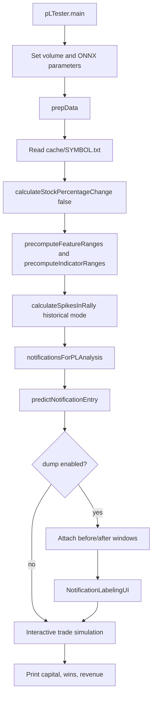
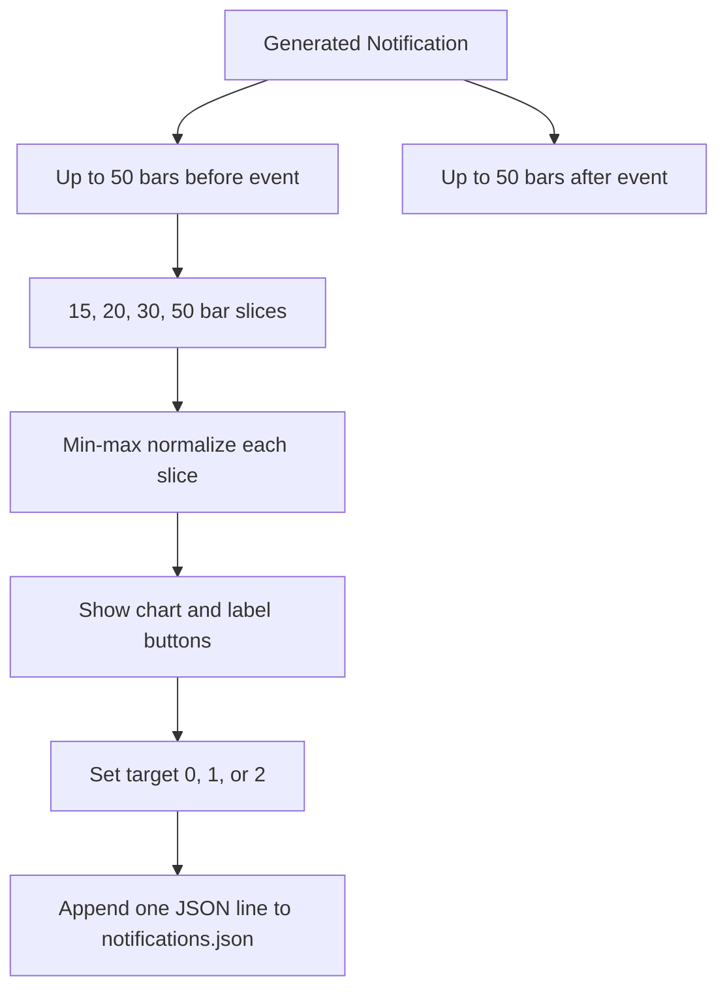
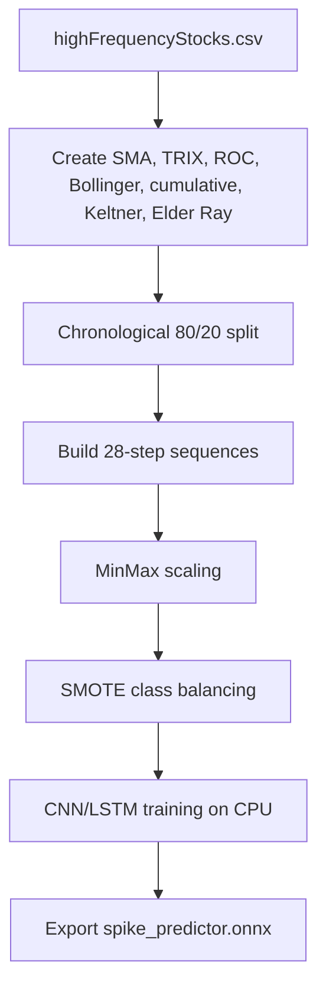
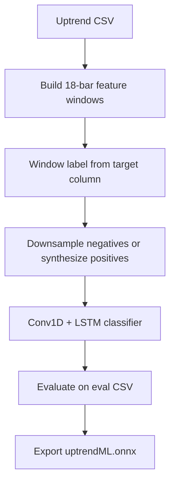
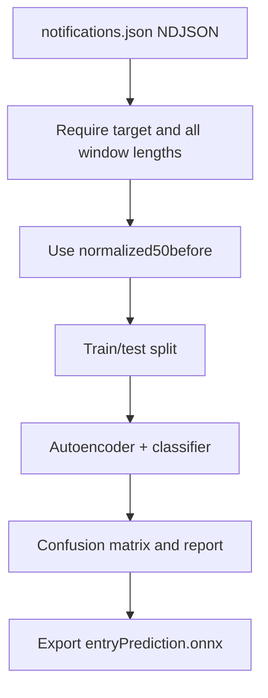

# Backtesting, Labeling, And Training

## Backtester Entry Point

Run:

```bash
mvn exec:java -Dexec.mainClass=org.crecker.pLTester
```

`pLTester` is used for:

- Loading cached stock data.
- Running historical notification generation.
- Displaying a chart for review.
- Labeling intervals for CSV training data.
- Labeling generated notifications for `notifications.json`.
- Simulating trade entry/exit decisions and printing P/L summaries.

The stock universe for the backtester is currently controlled by the `SYMBOLS` constant in `pLTester`.

## Backtest Flow



## Notification Labeling

`NotificationLabelingUI` shows one generated notification at a time and lets you label it:

- Good = `2`
- Neutral = `1`
- Bad = `0`
- Skip = no write

For each shown notification, it creates:

- Raw `beforeWindow`
- Raw `afterWindow`
- Normalized lookback windows: 15, 20, 30, 50 bars

Then `pLTester.dumpNotifications` appends the record to `rallyMLModel/notifications.json`.



## Chart Interval Labeling

`pLTester` also supports manual interval labeling directly on a chart:

- Drag on the chart to mark an interval.
- StockUnit bars inside that interval get `target=1`.
- `Clear Last` resets the latest interval to `target=0`.
- `Save Labels (spike)` writes `rallyMLModel/highFrequencyStocks.csv`.
- `Save Labels (uptrend)` writes `rallyMLModel/uptrendStocks.csv`.

CSV columns:

```text
timestamp,open,high,low,close,volume,target
```

## Python Environment

There is no requirements file. Create a local environment from `rallyMLModel/`:

```bash
cd rallyMLModel
python -m venv .venv
source .venv/bin/activate
pip install numpy pandas tensorflow tf2onnx scikit-learn imbalanced-learn matplotlib keras
```

Run the Python scripts from `rallyMLModel/` so relative input/output paths line up.

## Spike Model Training

Script: `rallyMLModel/spikeModel.py`

Input:

```text
highFrequencyStocks.csv
```

Output:

```text
spike_predictor.onnx
```

Flow:



Run:

```bash
cd rallyMLModel
python spikeModel.py
```

## Uptrend Model Training

Script: `rallyMLModel/uptrendML.py`

Default input files:

```text
uptrendStocksQUBTUNAMBG__target_clean__minrun8_gr0.9_red1_ret0.002_gap0.csv
uptrendStocksOBTSUNAMBG__target_clean__minrun8_gr0.9_red1_ret0.002_gap0.csv
```

Output:

```text
uptrendML.onnx
```

Features:

```text
close, ma_10, slope_5, ret_1
```

Run with defaults:

```bash
cd rallyMLModel
python uptrendML.py
```

Run with explicit clean target:

```bash
cd rallyMLModel
python uptrendML.py \
  --train-file uptrendStocksQUBTUNAMBG__target_clean__minrun8_gr0.9_red1_ret0.002_gap0.csv \
  --eval-file uptrendStocksOBTSUNAMBG__target_clean__minrun8_gr0.9_red1_ret0.002_gap0.csv \
  --target-col target_clean \
  --norm zscore
```

Optional autoencoder mode:

```bash
python uptrendML.py --use-ae --plot-dir ae_plots
```

Flow:



## Entry Prediction Training

Script: `rallyMLModel/entryPrediction.py`

Input:

```text
notifications.json
```

Output:

```text
entryPrediction.onnx
```

The script currently trains on `normalized50before` windows and validates against the same file path by default.

Run:

```bash
cd rallyMLModel
python entryPrediction.py
```

Flow:



## Uptrend Helper Scripts

### Clean Dataset Sweep

Script:

```bash
python helpers/uptrend_generate_clean_dataset.py --file uptrendStocksQUBTUNAMBG.csv --export-best
```

Purpose:

- Generate a `target_clean` label based on clean green runs.
- Sweep parameters such as minimum run length, green ratio, red-candle allowance, return, and merge gap.
- Export best/top-k results.

### EDA

Script:

```bash
python helpers/uptrend_eda.py --file uptrendStocksQUBTUNAMBG.csv
```

Purpose:

- Produce overview plots, volume plots, return distributions, correlation heatmaps, intraday profile, and target-run
  charts.

### Positive Context

Script:

```bash
python helpers/uptrend_positive_context.py --file uptrendStocksQUBTUNAMBG.csv --target-col target_clean
```

Purpose:

- Visualize positive target runs with pre/post context.
- Compare target-based runs and heuristic clean-green runs.

## Training-to-Java Contract

After training:

1. Replace the matching ONNX file in `rallyMLModel/`.
2. Start Java.
3. Confirm `RallyPredictor.setParameters()` can inspect all three models.
4. Confirm Java inference input names still match:

    - Spike model: `args_0`
    - Uptrend model: `input`
    - Entry model: `input`

5. Run a short historical backtest before using live hype mode.

