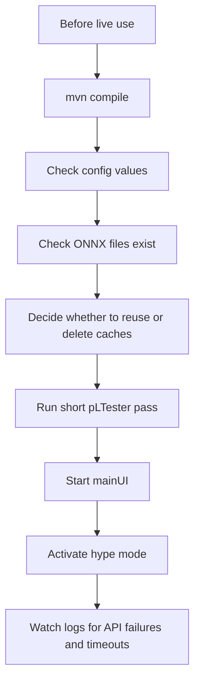

# Maintenance And Troubleshooting

## Common Tasks

### Add Or Change A Market Regime

1. Edit `mainDataHandler.stockCategoryMap`.
2. Add the symbol list under a new regime key.
3. Make sure `settingsHandler` exposes the regime in its combo box.
4. Set `<market>` in `config.xml` or choose it in Settings.
5. Delete any stale root cache file like `newRegime_40000.txt` if you need the tradability filter to rerun.

### Add A New Watchlist Symbol

Use the UI search/add flow, then save config. The watchlist is stored as:

```text
[SYMBOL,java.awt.Color[r=R,g=G,b=B]],[NEXT,java.awt.Color[r=R,g=G,b=B]]
```

If editing manually, preserve that format.

### Refresh Historical Cache

Delete a file under `cache/` and run hype mode or a fetch utility again:

```bash
rm cache/NVDA.txt
```

The next full intraday fetch writes a new cache file.

### Replace A Model

1. Train the model from `rallyMLModel/`.
2. Keep the expected filename.
3. Restart Java so ONNX sessions and shape parameters are reloaded.
4. Verify with backtesting before live use.

### Disable Push Notifications

Clear the `push` value in `config.xml` or Settings. Also keep in mind `sendPushNotification` invokes `curl`; if `curl`
is missing or endpoint is invalid, errors print to stderr.

## Troubleshooting

| Symptom                               | Likely cause                                                   | What to check                                           |
|---------------------------------------|----------------------------------------------------------------|---------------------------------------------------------|
| App exits saying API key is needed    | `key` is empty                                                 | Settings or `config.xml` tag index 3                    |
| No native macOS notification          | `terminal-notifier` missing                                    | `brew install terminal-notifier`                        |
| PushCut not received                  | Bad endpoint or `curl` problem                                 | `push` config, console output                           |
| No alerts in hype mode                | No symbols passed liquidity, no model confidence, or no ranges | Root regime cache file, `SYMBOL_INDICATOR_RANGES`, logs |
| ONNX inference returns `0`            | Missing model, bad input name, not enough rolling history      | Model files and `RallyPredictor.setParameters()`        |
| Backtester finds no data              | Missing cache file for `pLTester.SYMBOLS`                      | `cache/SYMBOL.txt`                                      |
| Python script cannot find files       | Ran from repo root instead of `rallyMLModel/`                  | `cd rallyMLModel` first                                 |
| Config values load wrong              | XML tag order changed                                          | Restore order from data/config docs                     |
| Chart looks distorted                 | Bad candle wick or split/outlier                               | Data clamp thresholds and cache quality                 |
| Hype mode repeats old symbol universe | Root `market_volume.txt` cache exists                          | Delete the file to refilter                             |

## Current Technical Debt To Remember

These are not necessarily bugs, but they matter during maintenance:

- `configHandler.loadConfig()` returns ordered XML nodes and `mainUI.setValues()` indexes into that order.
- There are many static mutable fields across `mainUI`, `mainDataHandler`, and `pLTester`.
- UI logic and data-processing logic are tightly coupled in places through static imports.
- Cache format depends on `StockUnit.toString()` and regex parsing.
- Several API flows are async callbacks mixed with blocking latches.
- `getInfoArray` calls the quote callback when quote data returns, even if fundamentals have not finished yet.
- ONNX model input/output names are hardcoded in Java.
- `RallyPredictor.prepareInputArray` repeats the latest spike feature vector across all timesteps for
  `spike_predictor.onnx`.
- Python scripts do not share one requirements file.
- Some generated files can be large and should stay out of git.

## Build Checks

Basic compile:

```bash
mvn -DskipTests compile
```

Package:

```bash
mvn -DskipTests package
```

Run main app:

```bash
mvn exec:java -Dexec.mainClass=org.crecker.mainUI
```

Run backtester:

```bash
mvn exec:java -Dexec.mainClass=org.crecker.pLTester
```

## Operational Checklist Before Live Use



## Known TODO Direction

The repo TODO mentions:

- Institutional purchase hunter.
- Insider trader hunter.
- Order book analyzer, probably trained first on free crypto order book data.
- Finish entry predictor evaluation and label semantics.
- Finish uptrend ML range fitting and Java/Python feature alignment.
- Recheck the newer parallel fetch path.

